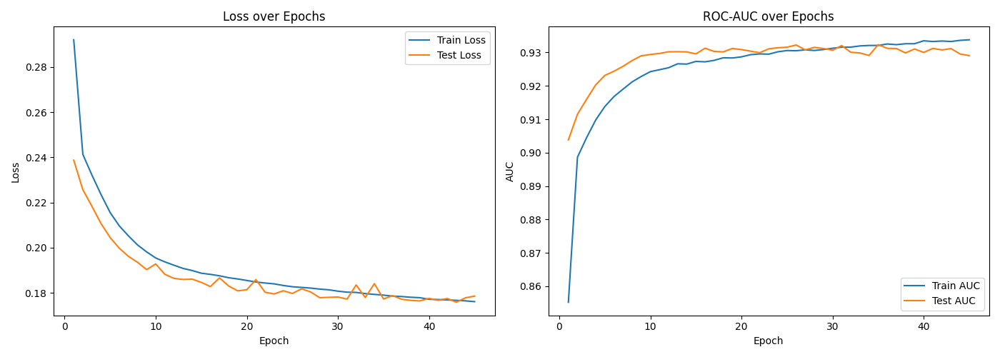
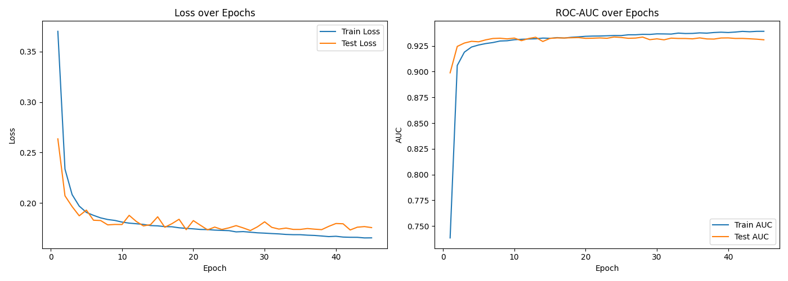
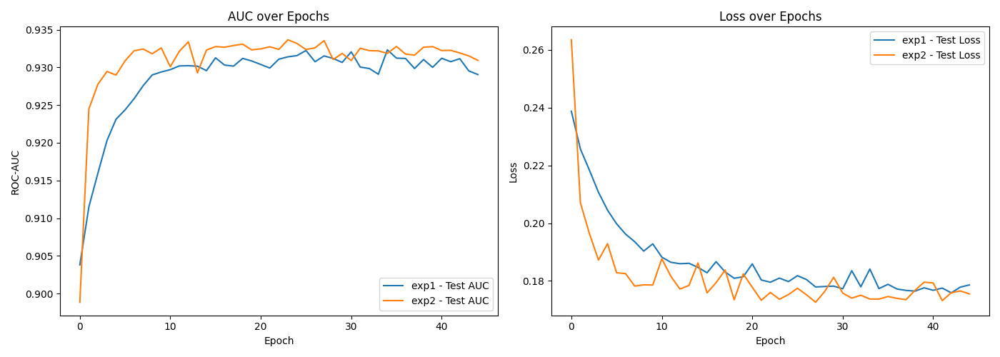
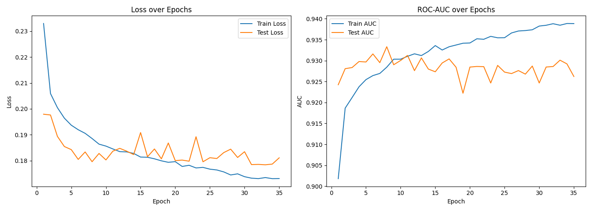
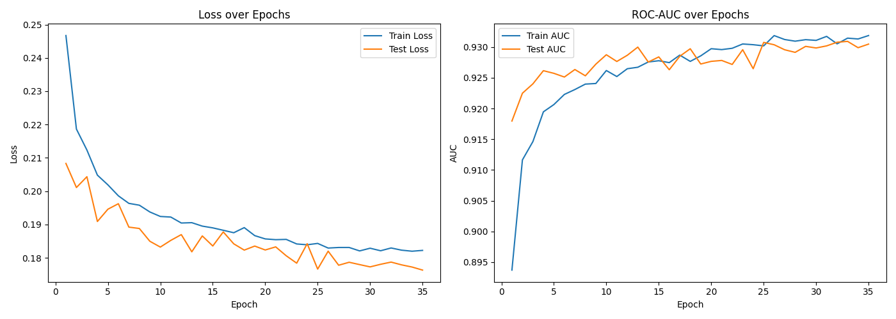
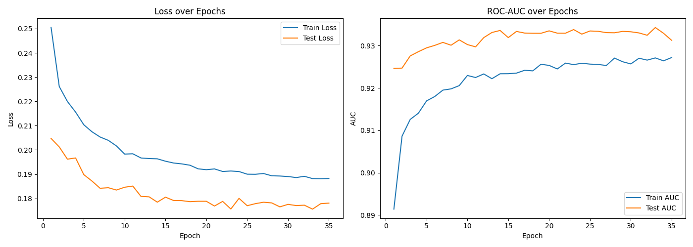
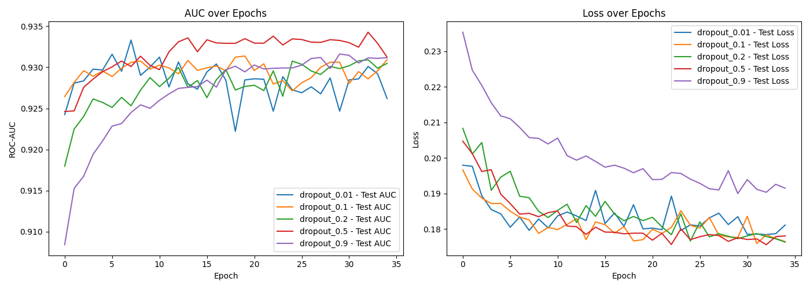
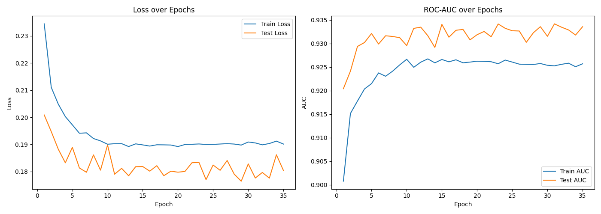

Проект был сделан в google colab.
.ipynb файл прилагается.

###### Добавили embedding-и!

Выводы по экспериментам:
# Эксперимент 1

Выводы:
По тестовым данным
* Минимальный loss: 0.1759
* Максимальный AUC: 0.9323

Embedding-и сильно улучшили ситуацию. Но всё ещё заметно, что где-то начиная с 30-й эпохи модель особо уже не обучается.
Я бы сказал, что оптимально взять 30-40 эпох.

# Эксперимент 2

Выводы:
По тестовым данным
* Минимальный loss: 0.1726
* Максимальный AUC: 0.9337

Здесь заметно, что переобучение происходит примерно на 27-й эпохе. График test_loss и test_auc стал чуть более резким и угловатым, однако в любом случае есть значительное улучшение относительно прошлой модели.

# Эксперимент 3

Выводы:

Skip Connections и Batch Norm не улучшили результат относительно 2 эксперимента. Вероятно это из-за того что такое усложнение модели делает её более чувствительной к batch_size и learning_rate, которые у нас могли быть выставлены не лучшим образом для такой модели.

Либо же ожидаемое улучшение результата могло бы сработать для модели с большим количеством слоёв. Точно сказать сложно.

Embedding-и немного улучшили результат, но всё ещё в этой модели почти моментально происходит переобучение и минмимумы по loss достигаются засчёт случайности.

* Минимальный loss: 0.1764
* Максимальный AUC: 0.9318

# Эксперимент 4
0.1

0.01

0.2

0.5

0.9

Все

Выводы:

Заметно улучшение относительно 3 эксперимента.
Наилучшая модель - dropout_rate = 0.5. До embedding-ов это было dropout_rate=0.1, однако результат изменился и теперь у нас 0.5 обучается заметно лучше, а признаки переобучения заметны на всех dropout_rate меньше 0.2.

Тем не менее модель всё ещё немного отстаёт от 2-го эксперимента по качеству.

Вероятно это всё ещё из-за неправильного learning_rate.

* Минимальный loss: 0.1755
* Максимальный AUC: 0.9312

# Эксперимент 5

Выводы:

Большой weight_decay для нашей задачи не подходит.

Аналогично, learning_rate=0.1 слишком велик и график test_loss сильно колеблется.

Теперь, с Embedding-ами, модель действительно показывает себя лучше 2-го эксперимента, однако, к сожалению, это отражается в AUC, но не в самой loss функции. Тем не менее можно заметить, что модель обучается побыстрее и её десйтвительно можно назвать улучшением, относительно второй модели.

Налучшая модель: lr=0.05_wd=0.001

* Test AUC: 0.9341
* Test Loss: 0.1760

