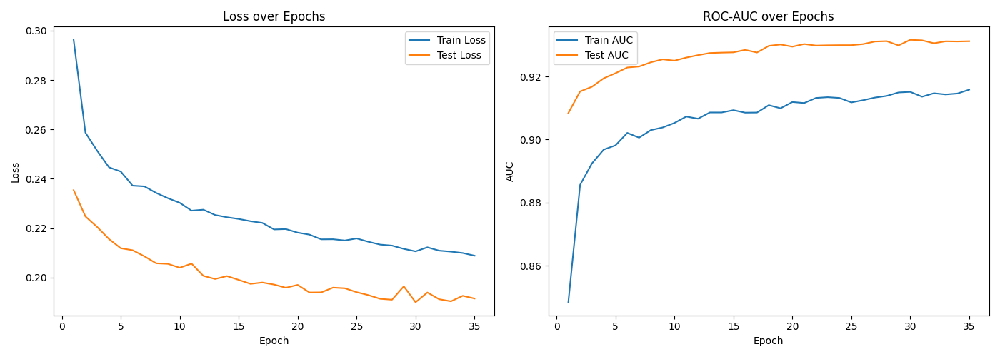
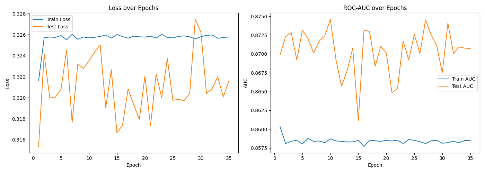
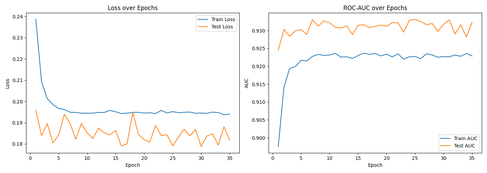
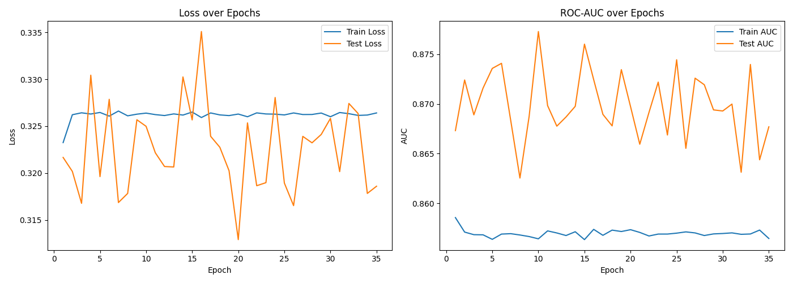

Проект был сделан в google colab.
.ipynb файл прилагается.

Выводы по экспериментам:
# Эксперимент 1

Выводы: По тестовым данным

* Минимальный loss: 0.1870
* Максимальный AUC: 0.9268

Где-то на 35-й эпохе заметно, что модель уже почти не обучается, а на 60-й точно происходит переобучение.

Я бы сказал, что оптимально взять 30 эпох.

# Эксперимент 2

Выводы:
По тестовым данным
* Минимальный loss: 0.1733
* Максимальный AUC: 0.9315

Здесь заметно, что переобучение происходит примерно на 25-й эпохе и новые минимумы по loss достигаются 
скорее засчёт случайности нежели 
из-за оптимального количества эпох.
График test_loss и test_auc стал ещё 
более резким и угловатым, однако в любом случае 
есть значительное улучшение относительно прошлой модели.

# Эксперимент 3

Выводы:

Skip Connections и Batch Norm не улучшили результат 
относительно 2 эксперимента. Вероятно это из-за того 
что такое усложнение модели делает её более чувствительной 
к batch_size и learning_rate, которые у нас могли быть
выставлены не лучшим образом для такой модели.

Либо же ожидаемое улучшение результата могло бы 
сработать для модели с большим количеством слоёв. 
Точно сказать сложно.

* Минимальный loss: 0.1792
* Максимальный AUC: 0.9297

# Эксперимент 4
0.1

0.01

0.2

0.5

0.9

Все

Выводы:

Заметно улучшение относительно 3 эксперимента. 
Наилучшая модель - dropout_rate = 0.1.

За 35 эпох переобучение можно заметить только при dropout_rate = 0.01, 
что значит, что dropout в данном случае действительно помог улучшить модель обучения.

Тем не менее модель всё ещё немного отстаёт от 2-го эксперимента по качеству.

Вероятно это всё ещё из-за неправильного learning_rate.

* Минимальный loss: 0.1845
* Максимальный AUC: 0.9305

# Эксперимент 5

Выводы:

Большой weight_decay для нашей задачи не подходит.

Аналогично, learning_rate=0.1 слишком велик и график test_loss сильно колеблется.

Возможно такая модель обогнала бы 2-й эксперимент очень сильно, если бы мы поставили большое количество эпох, но есть ощущение, что это было бы скорее по случайности, чем из-за реально оптимальной модели обучения.

Возможно стоило бы перебрать другие значения learning_rate или каким-то образом доработать модель, но пока что выглядит так, что мы лишь переусложняем задачу, которая неплохо решалась и на 2-м эксперименте.

Налучшая модель: lr=0.05_wd=0.001

* Test AUC: 0.9321
* Test Loss: 0.1820

Технически, по ROC-AUC она действительно обогнала 2-ю модель, так что можно считать эту модель улучшением.

